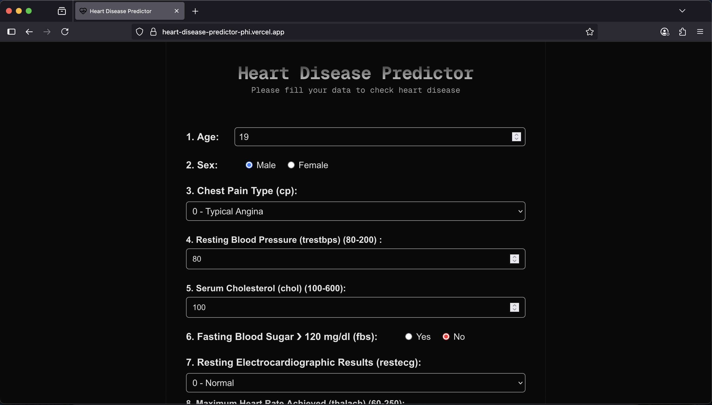

# 🫀 Heart Disease Predictor

FULL STACK ML  PROJECT

A machine learning-powered web application to predict the likelihood of heart disease based on patient health data. Built with **FastAPI** for the backend and **Next.js** for the frontend.

## 🚀 Live Demo

🔗 [Site](https://heart-disease-predictor-phi.vercel.app)  



## 🧠 Tech Stack

- **Frontend:** Next.js, Tailwind CSS, React
- **Backend:** FastAPI, joblib (for model loading)
- **Model:** Trained with Scikit-learn on a heart disease dataset
- **Deployment:** Vercel (frontend), Railway (backend)

## 📊 Features

- Input patient data like age, cholesterol, blood pressure, etc.
- Get instant prediction (0 = No heart disease, 1 = Potential heart disease)

## 📦 Backend Setup

### Prerequisites

- Python 3.8+
- `pip install -r requirements.txt`

### Run locally

```bash
uvicorn main:app --reload
```

# Deployment

- The backend is deployed using Railway.
- Ensure the following files are present:
    - `model.pkl` – Trained ML model
    - `scaler.pkl` – StandardScaler used during training
    - `columns.pkl` – Feature column names used for prediction

# CORS Setup

```py
app.add_middleware(
    CORSMiddleware,
    allow_origins=["https://heart-disease-predictor-phi.vercel.app"],
    allow_credentials=True,
    allow_methods=["*"],
    allow_headers=["*"],
)
```

#  API Endpoint

 `POST /predict`

**Request Body (JSON)**

```json
{
  "age": 45,
  "sex": 1,
  "cp": 3,
  "trestbps": 130,
  "chol": 250,
  "fbs": 0,
  "restecg": 1,
  "thalach": 170,
  "exang": 0,
  "oldpeak": 1.5,
  "slope": 2,
  "ca": 0,
  "thal": 2
}
```

**Response**

```json
{
  "prediction": 1
}
```

Made with ❤️ by [kishore-sv](github.com/kishore-sv)


